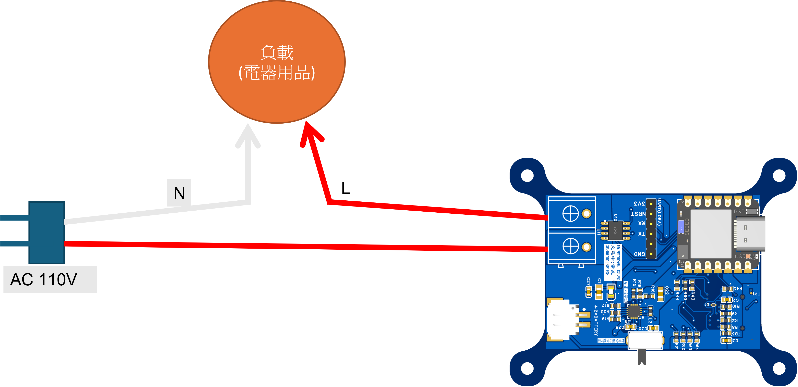

# AI for sensor picochu電流量測開發板
## 全開源的TinyAI推論的感測器開發板
### AI由數據、算法、算力組成，AI for sensor可以便利的蒐集數據、提供算力、自行實現屬於自己的演算法在開發板上即時推論。


### 該開發板通常適用於AC220V以下電器的電流量測，連接方式如下圖所示，將L與N其中一條串連進開發板的端口

## 該開發板支援範例程式所需要安裝依賴的函數庫如下
1. Adafruit NeoPixel
2. Button2
3. RPi_Pico_TimerInterrupt
## 各個範例程式簡要說明 :
* Lab1：按鈕切換狀態
* Lab2：按鈕寫入資料至SD卡
* Lab3：按鈕寫入資料至SD卡並依照狀態命名
* Lab4：按鈕寫入1000筆資料隨機亂數的資料至SD卡並依照狀態命名
* Lab5：按鈕寫入ADC取樣的資料至SD卡並依照狀態命名
* Lab7s:按鈕寫入以1000HzADC取樣的資料至SD卡並依照狀態命名
* sch 存放PCB原理圖、BOM表、座標文件
* Inference 推論程式碼

如果在推論中遇到__PKHTB的錯誤的話需要到```文件\Arduino\libraries\Pico_inferencing\src\edge-impulse-sdk\dsp```中的```config.hpp```進行修改
在
```#endif // Mbed / ARM Core check
#endif // ifndef EIDSP_USE_CMSIS_DSP
```
之後添加
```
#define __PKHBT(ARG1, ARG2, ARG3) ( (((int32_t)(ARG1) << 0) & (int32_t)0x0000FFFF) | \
                                    (((int32_t)(ARG2) << (ARG3)) & (int32_t)0xFFFF0000) )
#define __PKHTB(ARG1, ARG2, ARG3) ( (((int32_t)(ARG1) << 0) & (int32_t)0xFFFF0000) | \
                                    (((int32_t)(ARG2) >> (ARG3)) & (int32_t)0x0000FFFF) )

```
