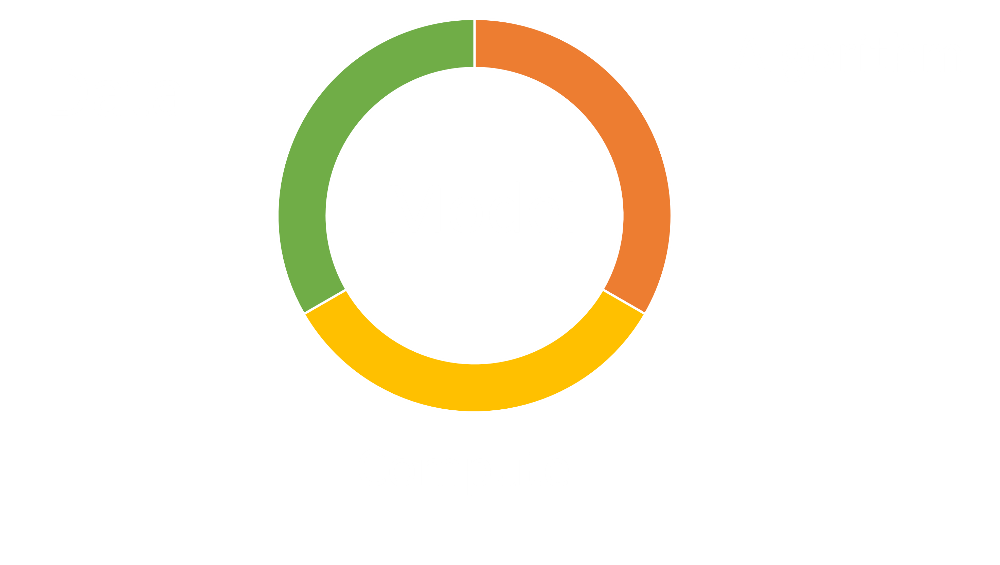

# AI for sensor picochu電流量測開發板
## 全開源的TinyAI推論的感測器開發板
### AI由數據、算法、算力組成，AI for sensor可以便利的蒐集數據、提供算力、自行實現屬於自己的演算法在開發板上即時推論。


### 該開發板通常適用於AC220V以下電器的電流量測，連接方式如下圖所示，將L與N其中一條串連進開發板的端口


## 各個範例程式簡要說明 :
* Lab1：按鈕切換狀態
* Lab2：按鈕寫入資料至SD卡
* Lab3：按鈕寫入資料至SD卡並依照狀態命名
* Lab4：按鈕寫入1000筆資料隨機亂數的資料至SD卡並依照狀態命名
* Lab5：按鈕寫入ADC取樣的資料至SD卡並依照狀態命名
* Lab7s:按鈕寫入以1000HzADC取樣的資料至SD卡並依照狀態命名
* sch 存放PCB原理圖、BOM表、座標文件
* Inference 推論程式碼

如果在推論中遇到__PKHTB的錯誤的話需要到```文件\Arduino\libraries\Pico_inferencing\src\edge-impulse-sdk\dsp```中的```config.hpp```進行修改
在
```#endif // Mbed / ARM Core check
#endif // ifndef EIDSP_USE_CMSIS_DSP
```
之後添加
```
#define __PKHBT(ARG1, ARG2, ARG3) ( (((int32_t)(ARG1) << 0) & (int32_t)0x0000FFFF) | \
                                    (((int32_t)(ARG2) << (ARG3)) & (int32_t)0xFFFF0000) )
#define __PKHTB(ARG1, ARG2, ARG3) ( (((int32_t)(ARG1) << 0) & (int32_t)0xFFFF0000) | \
                                    (((int32_t)(ARG2) >> (ARG3)) & (int32_t)0x0000FFFF) )

```

1. 準備好硬體並連接上
2. 安裝Arduino IDE[下載連接](0https://support.arduino.cc/hc/en-us/articles/360019833020-Download-and-install-Arduino-IDE)
3. 在偏好設定中添加入網址``` https://github.com/earlephilhower/arduino-pico/releases/download/global/package_rp2040_index.json ```
4. 在Arduino開發版管理員中下載Raspberry Pi pico 提供者 Earle F.Philhower,III
5. 在Arduino IDE中安裝以下Libary
    * Adafruit NeoPixel
    * Button2
    * RPi_Pico_TimerInterrupt
6. 選擇Lab7s.ino 選擇XIAO RP2040開發版 與所連接的COM口將程式上傳
7. 確認SD卡是空白的並且插入之後，在上電，此時開發版會亮燈，每按一次按鈕都可以進行數據採樣
8. 接下來註冊Edge Impulse帳號[網址](https://edgeimpulse.com/)
9. 在Edge Impulse創立新專案，並取名專案名字
10. 先將數據透過Edge impulse專案頁面左側 Data acquisition 將SD卡的資料搬移到電腦資料夾，csv格式的data上傳到專案中
11. 接下來開始設計你的AI訓練流程
12. 部屬將其導出成Arduino格式的函式庫，並將導出的模型.zip檔案加入arduinoIDE中，可以參照範例程式中的inference/inferencing去修改(只需要修改include的包即可work)